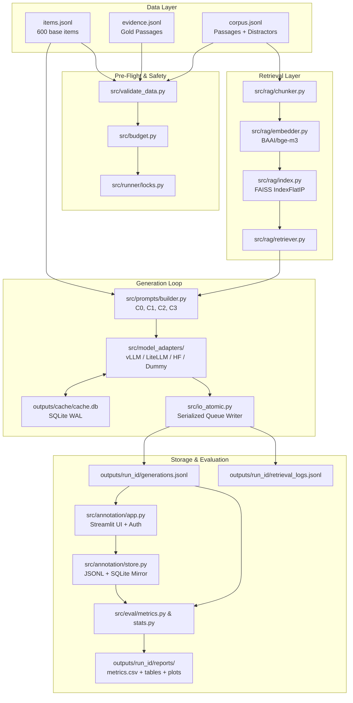

# Matibhrom (মতিভ্রম) — Bengali LLM Hallucination Benchmark & Experiment Platform

### *When Do LLMs Hallucinate in Bangla? A Controlled Study Across Register, Domain, and Evidence Conditions*

> **Team:** Team Turtlers  
> **Authors:** Akib Hasan Pyil, Abu Saleh Mohammad Jaeef, Shibli Nomani Sabit  
> **Mentor / Supervisor:** S M Asif Hossain  
> **Lab / Organization:** ELITE Research Lab LLC  
> **Repository:** [https://github.com/HippomasAKiB1/matibhrom](https://github.com/HippomasAKiB1/matibhrom)  
> **Specification Version:** v3 (Publishable) · September 2026  

---

## 1. Origin of the Name (Why "Matibhrom")

**Matibhrom** (মতিভ্রম) is a classical Bangla compound noun formed from **মতি** (*mati* — intellect, cognition, or mental faculty) and **ভ্রম** (*bhrom* — error, wandering, illusion, or aberration).

In Bangla literature and idiom, *matibhrom* refers to an intellectual lapse where an entity speaks or decides under a mistaken belief of truth. In Large Language Models (LLMs), "hallucination" precisely captures this failure mode: generating plausible, fluent, but factually ungrounded or contradictory claims. The name honors the linguistic root while anchoring the research strictly in Bangla natural language processing.

*(Note: For file system, CLI, and container compatibility, Bengali script appears only in descriptive metadata; all repository paths, configs, and identifiers use standard `matibhrom`)*.

---

## 2. Summary & Problem Statement

### The Problem
Large Language Models exhibit severe reliability issues when generating content in non-English, lower-resource, or diglossic language registers. In Bangla NLP:
1. **Linguistic Register Mismatch:** Users communicate in both **Standard Bangla** (`bn`) and Romanized **Banglish** (`banglish`). Little empirical work demonstrates whether phonological/syntactic transliteration amplifies unsupported model hallucinations.
2. **Conflating Retrieval vs. Generation Failures:** Existing benchmarks fail to distinguish between hallucinations caused by **missing knowledge** versus the model's **inability to utilize provided evidence**.
3. **Realistic RAG Gap:** The practical performance degradation introduced by vector indexing, noise, and passage chunking compared to oracle gold evidence has not been systematically mapped for Bangla.
4. **Abstention Reliability:** Calibrating models to abstain cleanly (i.e., gracefully declining to answer when evidence is insufficient) without causing excessive coverage loss is critical for high-stakes domains (Medical and Legal).

### The Solution: Matibhrom
Matibhrom is an end-to-end, scientifically controlled evaluation platform designed to answer:
> *Under which linguistic and evidence conditions do LLMs produce unsupported or incorrect information in Bangla, and how much of that failure can be reduced by retrieval and calibrated abstention?*

The platform enforces rigorous experimental control across **4 conditions**, **2 language registers**, and **3 domains** (General Factual, Medical, Bangladeshi Legal):
- **C0 (No Evidence):** Closed-book generation measuring parametric knowledge hallucinations.
- **C1 (Oracle Evidence):** Gold evidence passage matched chunk-for-chunk with RAG context length to establish an upper bound.
- **C2 (Realistic RAG):** Vector retrieval using FAISS + dense embeddings (`BAAI/bge-m3`) over a distractor corpus.
- **C3 (RAG + Abstention):** Identical context to C2 paired with strict evidence-sufficiency abstention rules.

---

## 3. Features Implemented

- **Pydantic v2 Strict Data Contracts:** Guaranteed data schemas (`extra="forbid"`) with semantic validation, foreign key checks, and near-duplicate detection via token Jaccard similarity.
- **Cross-Process Atomic I/O & Concurrency Locks:** Dedicated background queue writers and `O_EXCL` lock files preventing corrupted writes or duplicate generation across parallel workers.
- **Resumable Generation Pipeline:** SQLite WAL-mode cache with schema, model, and prompt version-aware invalidation.
- **Budget Guard & Cost Projection:** Automatic pre-flight pricing check and token estimation refusing execution if budget caps are exceeded.
- **Unified Multi-Engine Model Adapters:** Out-of-the-box support for API providers (via LiteLLM with exponential backoff), high-throughput local inference (`vLLM`), HuggingFace Transformers fallback, and mock dummy adapters.
- **Chunk-Matched RAG & Identical Context Guarantees:** Ensures C1 matches C2 chunk budgets, and C2/C3 contexts are byte-identical for identical queries.
- **Human + LLM Annotation Platform:** Streamlit-based double-blind annotation interface supporting token authentication, randomized order, adjudication workflows, and LLM pre-label verification.
- **Statistical Evaluation & Table Export:** Calculation of hallucination rate, coverage, selective accuracy, Cohen's Kappa ($κ$), McNemar's paired test, mixed-effects logistic regression, and automated LaTeX/Markdown report generators.
- **Frozen Test-Split Dual-Factor Protection:** Runner prevents accidental test set contamination unless explicitly authorized with both a CLI flag (`--unlock-test`) and environment variable (`MATIBHROM_UNLOCK_TEST=1`).

---

## 4. Architecture & Data Flow

### System Architecture Diagram



### Core Data Models
| Entity | Key Schema Attributes | File Contract |
|---|---|---|
| **Item** | `item_id`, `domain`, `question_bn`, `question_banglish`, `gold_answer`, `evidence_id`, `answer_type`, `risk_tag`, `split`, `group_key` | `data/dummy/items.jsonl` |
| **Evidence** | `evidence_id`, `text`, `source_url_or_id`, `source_date`, `domain` | `data/dummy/evidence.jsonl` |
| **CorpusPassage** | `passage_id`, `text`, `source_url_or_id`, `source_date`, `domain`, `is_gold_for` | `data/dummy/corpus.jsonl` |
| **Generation** | `run_id`, `generation_id`, `item_id`, `language`, `condition`, `model_id`, `prompt`, `prompt_hash`, `prompt_tokens`, `response`, `evidence_ids_used`, `cost_usd`, `truncated_input` | `outputs/{run_id}/generations.jsonl` |
| **RetrievalLog** | `run_id`, `item_id`, `language`, `query`, `retrieved`, `gold_retrieved`, `recall_at_k`, `index_version`, `corpus_version` | `outputs/{run_id}/retrieval_logs.jsonl` |
| **Annotation** | `generation_id`, `annotator_id`, `labeler_type`, `correctness`, `hallucination`, `error_type`, `abstention_status`, `is_overlap`, `verified_by_human` | `outputs/{run_id}/annotations.jsonl` |

---

## 5. Tech Stack & Project Structure

### Tech Stack
- **Language & Runtime:** Python 3.11 / 3.12+
- **Validation:** Pydantic v2
- **Configuration:** YAML + OmegaConf
- **Vector Retrieval:** FAISS (CPU/GPU) + Sentence-Transformers (`BAAI/bge-m3`)
- **LLM Inference:** `vLLM` (Local GPU), `LiteLLM` (OpenAI / Anthropic / Gemini), Hugging Face `transformers`
- **Annotation & Dashboard:** Streamlit
- **Analytics & Statistics:** Scikit-Learn, SciPy, Statsmodels, Matplotlib, Seaborn
- **Testing:** Pytest, Pytest-Cov

### Project Directory Layout
```
matibhrom/
├── README.md                      # Primary project documentation & operational guide
├── RESEARCH_SPEC.md               # Complete reference PRD & research specification (v3)
├── DECISIONS.md                   # Architecture & implementation decisions log
├── BUDGET.md                      # Cost, compute, and token budget estimations
├── CONTRIBUTING.md                # Collaboration standards & branch protocols
├── Makefile                       # Developer shortcuts (test, run, validate)
├── Dockerfile                     # CPU container specification
├── Dockerfile.gpu                 # GPU container specification (vLLM + CUDA)
├── pyproject.toml                 # Package configuration & dependencies
├── requirements-cpu.txt           # CPU-only pinned dependencies
├── requirements-gpu.txt           # GPU/CUDA accelerated dependencies
├── .env.example                   # Environment configuration template
├── .gitignore                     # Git tracking exclusions
├── configs/                       # Configuration definitions
│   ├── models.yaml                # Model registries & inference parameters
│   ├── experiments.yaml           # Experiment runs, splits, and condition definitions
│   ├── rag.yaml                   # Chunk size, overlap, embedding model, top_k
│   ├── budget.yaml                # Pricing table per 1M tokens & hard budget cap
│   ├── annotation.yaml            # Sampling scope, overlap ratio, token configs
│   ├── annotation_tokens.example.json # Annotator credentials template
│   └── prompts/                   # Condition prompts for bn & banglish
├── data/                          # Dataset stores
│   ├── dummy/                     # 6 items + 6 evidence + 20 corpus passages
│   ├── benchmark/                 # Full 600-item research dataset (gitignored)
│   └── splits/                    # Derived split files (dev.jsonl, test.jsonl)
├── src/                           # Core implementation package
│   ├── schema.py                  # Pydantic v2 data models
│   ├── schema_version.py          # Version identifiers
│   ├── validate_data.py           # Benchmark integrity validator
│   ├── hashing.py                 # Deterministic hashing helpers
│   ├── budget.py                  # Pre-flight cost calculator and guard
│   ├── io_atomic.py               # Serialized queue-based atomic JSONL writer
│   ├── model_adapters/            # Adapter interface (dummy, litellm, vllm, hf)
│   ├── prompts/                   # Condition-based prompt builder
│   ├── rag/                       # Chunker, Embedder, Index, and Retriever
│   ├── runner/                    # Runner CLI, generation loop, cache, locks
│   ├── annotation/                # Streamlit annotation UI, auth, SQLite store
│   └── eval/                      # Evaluation metrics, stats, LaTeX reporting
├── scripts/                       # Operational CLI utilities
│   ├── build_index.py             # Build and freeze FAISS index
│   ├── check_budget.py            # Calculate projected costs without execution
│   ├── export_tables.py           # Generate publication LaTeX tables & plots
│   ├── make_splits.py             # Generate derived split datasets
│   ├── migrate_schema.py          # Validate / migrate older schema versions
│   └── sample_for_annotation.py   # Stratified annotation sampling (Scope A/B/C)
└── tests/                         # Test suite
    ├── test_core_smoke.py         # Smoke tests (validation, budget, prompts, cache)
    └── test_annotation_and_rag.py # Annotation store, auth, pre-labeling, RAG context
```

---

## 6. Configuration & Environment Variables

### Environment Variables
Configure by copying `.env.example` to `.env`:
```bash
cp .env.example .env
```
| Variable | Description | Default / Example |
|---|---|---|
| `OPENAI_API_KEY` | OpenAI API key for LiteLLM inference / pre-labeling | `sk-...` |
| `ANTHROPIC_API_KEY` | Anthropic API key | `sk-ant-...` |
| `GOOGLE_API_KEY` | Google Gemini API key | `AIza...` |
| `HF_TOKEN` | Hugging Face authentication token | `hf_...` |
| `MATIBHROM_UNLOCK_TEST`| Safety guard: must be `1` to run against the frozen test split | `0` |

### Configuration Files
- **`configs/experiments.yaml`**: Configures active `split`, conditions (`C0`, `C1`, `C2`, `C3`), languages (`bn`, `banglish`), worker threads, and seed.
- **`configs/models.yaml`**: Specifies active model IDs, adapters (`vllm`, `litellm`, `hf`, `dummy`), paths, and parameters (temperature, max tokens).
- **`configs/rag.yaml`**: Controls vector retrieval (`top_k`, chunk sizes, overlap, embedding model).
- **`configs/budget.yaml`**: Defines maximum allowed cost (`max_usd: 500.00`) and per-model pricing per million tokens.

---

## 7. Setup & Installation

### Local Python Environment (CPU)
```bash
# 1. Clone repository
git clone https://github.com/HippomasAKiB1/matibhrom.git
cd matibhrom

# 2. Create virtual environment
python -m venv .venv
# Linux / macOS:
source .venv/bin/activate
# Windows PowerShell:
.\.venv\Scripts\Activate.ps1

# 3. Install CPU dependencies
pip install -r requirements-cpu.txt

# 4. Copy environment configuration
cp .env.example .env
```

### Local GPU Environment (CUDA & vLLM)
```bash
pip install -r requirements-gpu.txt
```

---

## 8. Running the Pipeline

### Step 1: Validate Dataset Integrity
Verify that all data contracts, evidence references, and corpus links meet strict consistency requirements:
```bash
python -m src.validate_data \
  --items data/dummy/items.jsonl \
  --evidence data/dummy/evidence.jsonl \
  --corpus data/dummy/corpus.jsonl \
  --min-corpus-passages 10
```

### Step 2: Build the Vector Index
Chunk corpus passages, compute embeddings, and build the frozen FAISS retrieval index:
```bash
python scripts/build_index.py \
  --config configs/rag.yaml \
  --run-id main_v1 \
  --min-corpus-passages 10
```

### Step 3: Run Pre-Flight Budget Check
Check projected costs without generating outputs:
```bash
python scripts/check_budget.py \
  --config configs/experiments.yaml \
  --models configs/models.yaml \
  --budget-config configs/budget.yaml \
  --items data/dummy/items.jsonl
```

### Step 4: Execute the Experiment Runner
Run generations across conditions and models on the dev split:
```bash
python -m src.runner.run \
  --config configs/experiments.yaml \
  --models configs/models.yaml \
  --rag-config configs/rag.yaml \
  --budget-config configs/budget.yaml \
  --run-id dev_run_01 \
  --split dev \
  --resume
```

*To execute on the frozen test split, both the `--unlock-test` flag and `MATIBHROM_UNLOCK_TEST=1` are required:*
```bash
python -m src.runner.run \
  --config configs/experiments.yaml \
  --split test \
  --unlock-test
```

### Step 5: Launch the Annotation UI
Launch the double-blind human annotation tool:
```bash
# Set up test annotator credentials
cp configs/annotation_tokens.example.json configs/annotation_tokens.json

# Launch Streamlit app
streamlit run src/annotation/app.py -- --run-id dev_run_01
```

### Step 6: Export Evaluation Metrics & Tables
Generate summary tables, LaTeX tables for research papers, and visualization charts:
```bash
python scripts/export_tables.py \
  --run-id dev_run_01 \
  --group-by condition \
  --items data/dummy/items.jsonl
```

---

## 9. Running Tests

The test suite validates data schemas, budget enforcement, prompt templates, atomic caching, RAG context matching, and annotation stores:
```bash
# Run all tests
python -m pytest -o addopts=""

# Run with test coverage (requires pytest-cov)
pytest --cov=src --cov-fail-under=80
```

---

## 10. Container Deployment (Docker)

### Build & Run with Docker (CPU)
```bash
# Build image
docker build -t matibhrom:cpu -f Dockerfile .

# Run container with mounted output directory
docker run --rm -it \
  -v $(pwd)/outputs:/app/outputs \
  --env-file .env \
  matibhrom:cpu python -m pytest -o addopts=""
```

### Build & Run with Docker (GPU / vLLM)
```bash
# Build GPU image
docker build -t matibhrom:gpu -f Dockerfile.gpu .

# Run with full GPU pass-through
docker run --gpus all --rm -it \
  -v $(pwd)/outputs:/app/outputs \
  --env-file .env \
  matibhrom:gpu
```

---

## 11. Key Decisions & Trade-Offs

Full rationale and alternatives considered are documented in [DECISIONS.md](file:///e:/ELITE%20Research%20Lab/Bengali%20LLM/matibhrom/DECISIONS.md). Summary:

| Decision | Selected Choice | Rationale |
|---|---|---|
| **Data Schema Validation** | Pydantic v2 with `extra="forbid"` | Guarantees exact schema compliance across all pipeline artifacts. Unknown fields fail immediately rather than passing silently. |
| **Annotation Budget Scope** | Option A: Stratified Subsample + LLM Pre-labeling | 100% human annotation of 15,360 generations is cost-prohibitive. Option A pre-labels with LLMs, verifies 20% stratified humans, and mandates 100% human checks on safety-critical medical/legal errors. |
| **Context Chunk-Matching** | C1 Gold Chunks match C2 RAG Context | Prevents confounding retrieval failure with differences in context length or noise. C1 and C2 present identical structural interfaces to the LLM. |
| **Resumability & Concurrency** | SQLite WAL Cache + Atomic `O_EXCL` Locks | Prevents duplicate generation costs upon interrupted runs while allowing multi-process parallelism across models and items. |
| **Cross-Platform IO Fallback** | Guarded `fcntl` with thread queues | Enables development and automated unit testing on Windows workstations while supporting POSIX advisory locking in production Linux environments. |

---

## 12. Known Limitations & Research Boundaries

1. **Non-Goals:** Mechanistic interpretability (attention map inspection), full LoRA parameter fine-tuning, and uncontrolled multi-dialect expansion are explicit non-goals for this benchmark.
2. **Tokenizer Vocabulary Limitations:** Many open-weight foundation models exhibit low tokenization compression efficiency on Bangla scripts, leading to higher token consumption and potential latency overheads compared to Latin scripts.
3. **Retrieval Domain Coverage:** RAG retrieval quality relies heavily on dense multilingual embedding representations (`bge-m3`). Out-of-domain Bangladeshi legal jargon may require domain-adapted bi-encoders for optimal recall.

---

## 13. Documentation Roadmap & References

- **[RESEARCH_SPEC.md](file:///e:/ELITE%20Research%20Lab/Bengali%20LLM/matibhrom/RESEARCH_SPEC.md):** The comprehensive research specification, PRD, formal hypothesis formulations (H1–H4), error taxonomy (H1–H5, A, R), and mathematical metrics definitions.
- **[DECISIONS.md](file:///e:/ELITE%20Research%20Lab/Bengali%20LLM/matibhrom/DECISIONS.md):** Chronological log of engineering decisions, trade-offs, and design choices.
- **[BUDGET.md](file:///e:/ELITE%20Research%20Lab/Bengali%20LLM/matibhrom/BUDGET.md):** Comprehensive compute resource, token pricing, and human annotation cost breakdowns.
- **[CONTRIBUTING.md](file:///e:/ELITE%20Research%20Lab/Bengali%20LLM/matibhrom/CONTRIBUTING.md):** Collaboration standards, branching rules, PR templates, and validation checklists.

---

## 14. License & Citation

This project is licensed under the **Apache License 2.0**.

If you use the Matibhrom platform, benchmark dataset, or evaluation harness in your research, please cite:

```bibtex
@misc{matibhrom2026,
  title={When Do LLMs Hallucinate in Bangla? A Controlled Study Across Register, Domain, and Evidence Conditions},
  author={Pyil, Akib Hasan and Jaeef, Abu Saleh Mohammad and Sabit, Shibli Nomani and Hossain, S M Asif},
  year={2026},
  publisher={ELITE Research Lab LLC},
  howpublished={\url{https://github.com/HippomasAKiB1/matibhrom}}
}
```
